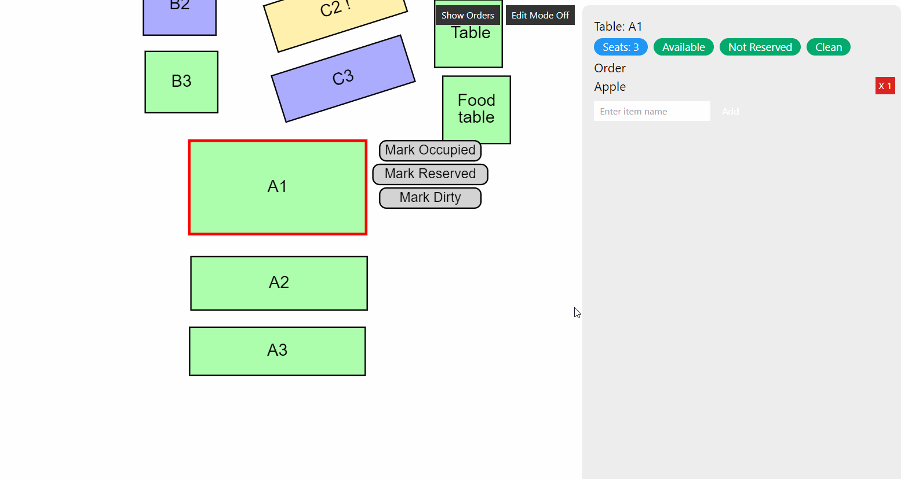

<div align="center">

  
  <h1 align="center">Rested</h1>
  <p align="center">A Restaurant Management System</p>
</div>


## Description
**Rested** is an innovative restaurant management system designed to revolutionize the way restaurants operate. This system streamlines the management of seating, reservations, and server workloads, leveraging advanced technology to enhance both customer experience and restaurant efficiency.

### Key Features:

- **Interactive Map View**: A top-down, dynamic view of the restaurant's seating layout, providing real-time visibility of table availability and occupancy.
- **Real-Time Updates and Alerts**: Keeps the staff updated on table status, reservation changes, and customer needs, ensuring a seamless flow of information.
- **Smart Seating Algorithm**: Our seating algorithm suggests optimal seating arrangements, balancing the workload among servers and promoting an even distribution of tips.
- **Efficient Reservation Management**: Manage table reservations with ease, reducing wait times and improving customer satisfaction.
- **Comprehensive Metrics**: Access valuable insights and metrics to make data-driven decisions for your restaurant's growth and efficiency.

### Technology Stack:

- **Docker**: For creating, deploying, and running applications using containerization.
- **NodeJS**: A JavaScript runtime built on Chrome's V8 JavaScript engine, perfect for scalable network applications.
- **ExpressJS**: for efficient backend routing.
- **ReactJS**: For frontend UI
- **Git**: Used for source code management, ensuring smooth collaboration and version control.


## Visuals
<div align="center">


</div>


# Installation
First clone the repository:
```bash
git clone "https://git.cs.usask.ca/cmpt370_team33/project.git"
```
## To run the app:
In the root directory run the following command in the terminal:
```bash
docker-compose up -d
```

#### Attach to both the client and server in seperate terminals

write
```bash
docker attach client
```

and in another terminal:

```bash
docker attach server
```

On both terminals write
```bash
npm install
```

and then on both write:
```bash
npm start
```

Note that it could take a while for ```npm start``` before you can access the app at ```localhost:3000```


## Authors and acknowledgment
Oren
Utsav
Ryan
Mykyta
Ethan
Quan
Talyn


## Project status

